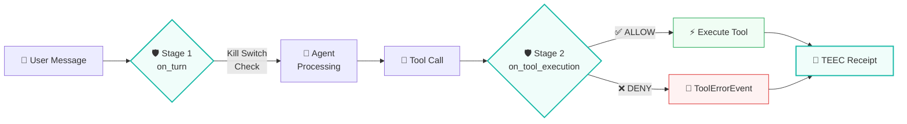
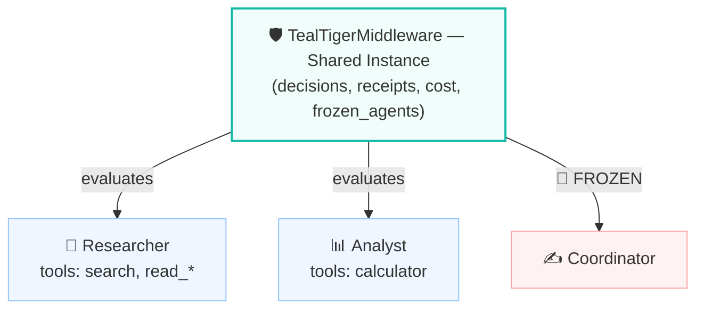
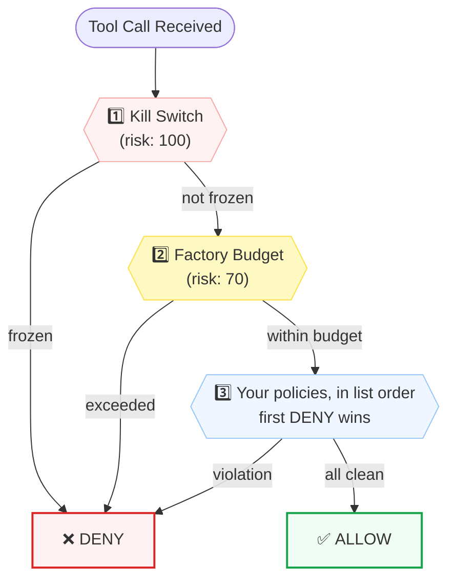
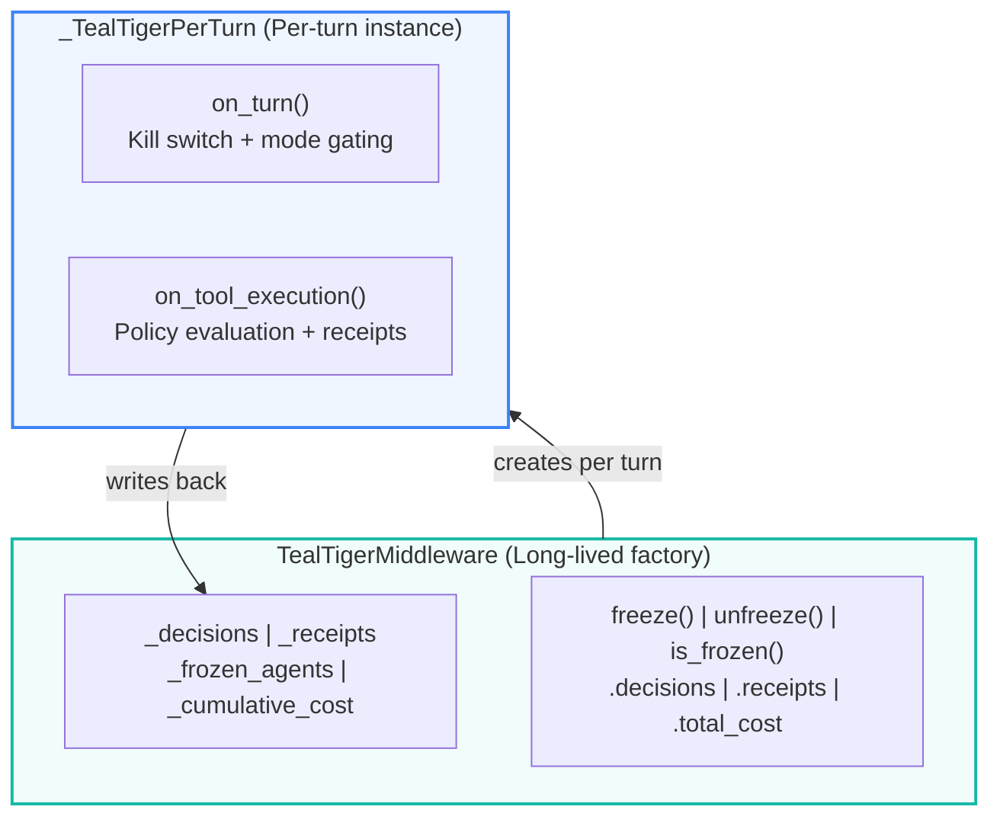

The `ag2.extensions.tealtiger` module adds deterministic governance guardrails to AG2 agents. `TealTigerMiddleware` enforces tool allowlists, detects PII and secrets in tool arguments, tracks per-session cost, provides per-agent kill switches, and produces structured TEEC audit receipts — with no LLM in the governance path.

## Installation

!!! note
    The extension ships with AG2. No additional Python package and no API key are required — all governance evaluation runs inline on the standard library.

```bash
pip install ag2
```

Import directly:

```python linenums="1"
from ag2.extensions.tealtiger import (
    GovernanceDecision,
    GovernanceMode,
    GovernancePolicy,
    TEECReceipt,
    TealTigerMiddleware,
)
```

## Quick Start

`TealTigerMiddleware` is a [middleware factory](/docs/user-guide/middleware) — pass the instance straight into an agent's `middleware` list.

```python linenums="1" hl_lines="7-15 21"
import asyncio

from ag2 import Agent
from ag2.config import AnthropicConfig
from ag2.extensions.tealtiger import GovernanceMode, GovernancePolicy, TealTigerMiddleware

governance = TealTigerMiddleware(
    mode=GovernanceMode.ENFORCE,
    policies=[
        GovernancePolicy.tool_allowlist(["search", "read_*"]),
        GovernancePolicy.pii_block(["ssn", "credit_card", "email", "phone"]),
        GovernancePolicy.secret_detection(),
        GovernancePolicy.cost_limit(max_per_session=5.0),
    ],
)

async def main() -> None:
    agent = Agent(
        "assistant",
        config=AnthropicConfig(model="claude-sonnet-4-6"),
        middleware=[governance],
    )
    reply = await agent.ask("Summarize the AG2 middleware guide.")
    print(await reply.content())
    print(governance.decisions)
    print(f"Cost: ${governance.total_cost:.4f}")

if __name__ == "__main__":
    asyncio.run(main())
```

Every tool call now flows through deterministic governance evaluation before execution.

## Multi-Stage Defense

TealTiger governs at two stages of the AG2 agent lifecycle:



| Hook | Stage | What It Does |
|------|-------|-------------|
| `on_turn` | Turn defense | Kill switch enforcement — frozen agents cannot take turns |
| `on_tool_execution` | Pre-tool defense | Tool allowlist, PII scan, secret scan, cost limit check |

Both stages activate from a single middleware instance. The **middleware factory** pattern keeps state (decisions, receipts, cost, frozen agents) alive across turns.

!!! note "Receipts come from the tool stage"

    A `TEECReceipt` is emitted for every *tool* evaluation, whether the call was executed or blocked. Turn-level kill switch denials record a `GovernanceDecision` but do **not** emit a receipt.

## Governance Modes

| Mode | Behavior | Use Case |
|------|----------|----------|
| **ENFORCE** | Evaluates all policies. Blocks violations with `ToolErrorEvent`. | Production |
| **MONITOR** | Evaluates all policies, records decisions, but **never blocks**. | Staging / shadow testing |
| **OBSERVE** | Skips policy evaluation. Passes through, still tracks cost and records an `OBSERVE_PASSTHROUGH` decision. | Initial rollout / lowest overhead |

`mode` accepts either a `GovernanceMode` member or its string name, and defaults to `GovernanceMode.ENFORCE`. Start with `MONITOR` in staging to see what would be blocked, then switch to `ENFORCE` in production:

```python linenums="1"
# Shadow mode — see what governance would deny without blocking anything
governance = TealTigerMiddleware(
    mode=GovernanceMode.MONITOR,
    policies=[
        GovernancePolicy.tool_allowlist(["search", "read_*"]),
        GovernancePolicy.pii_block(["ssn", "credit_card"]),
    ],
)

# After validation, promote to ENFORCE
governance.mode = GovernanceMode.ENFORCE
```

## Policy Types

### Tool Allowlist

Restrict which tools the agent can call. Patterns are matched with `fnmatch`, so the full glob syntax (`*`, `?`, `[seq]`) applies:

```python linenums="1"
GovernancePolicy.tool_allowlist(["search", "read_*", "github_*"])
```

Any tool not matching the patterns is denied with reason code `TOOL_NOT_ALLOWED` and risk score 80.

### PII Detection

Block tool calls containing sensitive data in their arguments:

```python linenums="1"
GovernancePolicy.pii_block(["ssn", "credit_card", "email", "phone"])
```

Passing no argument applies all four categories:

| Category | Pattern | Example Match |
|----------|---------|---------------|
| `ssn` | `\b\d{3}-\d{2}-\d{4}\b` | 123-45-6789 |
| `credit_card` | `\b(?:\d{4}[-\s]?){3}\d{4}\b` | 4111-1111-1111-1111 |
| `email` | Standard email regex | user@example.com |
| `phone` | US phone with optional `+1` | +1-555-123-4567 |

Denied with risk score 90. One reason code is appended per matched category, in the form `PII_DETECTED:ssn`, `PII_DETECTED:email`, and so on.

### Secret Detection

Block tool calls containing API keys, tokens, or credentials:

```python linenums="1"
GovernancePolicy.secret_detection()
```

| Pattern | What It Catches |
|---------|----------------|
| `sk-…` (20+ chars) | OpenAI-style API keys |
| `ghp_…` (36+ chars) | GitHub personal access tokens |
| `AKIA…` (16 chars) | AWS access key IDs |
| `xox[bpors]-…` | Slack tokens |
| `api_key=…` / `apikey:…` (20+ chars) | Generic API keys |
| PEM private key headers | RSA, EC, DSA private keys |

Denied with reason code `SECRET_DETECTED` and risk score 95 — the highest of the policy checks.

### Cost Limit

Enforce per-session cost ceilings:

```python linenums="1"
GovernancePolicy.cost_limit(max_per_session=5.0)
```

Cumulative cost is tracked across all tool calls using `cost_per_call` (configurable, defaults to `0.002`). Once the limit is reached, further calls are denied with `BUDGET_EXCEEDED` and risk score 70.

## Factory-Level Budget

In addition to the policy-level `cost_limit`, you can set a factory-level budget that is always enforced, with no policy needed:

```python linenums="1"
governance = TealTigerMiddleware(
    budget_limit=10.0,      # Hard ceiling — always enforced
    cost_per_call=0.002,    # Estimated cost per tool call
    policies=[
        GovernancePolicy.tool_allowlist(["search", "read_*"]),
    ],
)
```

`budget_limit` defaults to infinity. It is checked before any policy runs, providing a spending cap that no policy ordering can bypass.

## Kill Switch

Freeze an agent immediately — this blocks its turns and all of its tool calls, regardless of policies:

```python linenums="1"
governance.freeze("assistant")      # Block everything for this agent
governance.is_frozen("assistant")   # True
governance.unfreeze("assistant")    # Restore normal governance
```

Freezing matches on the **exact** agent name. There is no wildcard — to freeze several agents, freeze each by name:

```python linenums="1"
for name in ("researcher", "analyst", "writer"):
    governance.freeze(name)
```

The kill switch is enforced at both the **turn level** (`on_turn`) and the **tool level** (`on_tool_execution`):

- **ENFORCE mode**: returns `ToolErrorEvent`, blocking the entire turn or tool call
- **MONITOR mode**: records a DENY decision but allows the action through
- **OBSERVE mode**: not evaluated (passthrough)

Kill switch decisions carry reason code `AGENT_FROZEN` and risk score 100 (maximum).

## Audit Trail

Every governance decision produces a structured `GovernanceDecision`:

```python linenums="1"
for decision in governance.decisions:
    print(
        f"[{decision.action}] tool={decision.tool_name} "
        f"agent={decision.agent_name} "
        f"reason_codes={decision.reason_codes} "
        f"risk={decision.risk_score} "
        f"latency={decision.evaluation_time_ms:.2f}ms "
        f"cost=${decision.cumulative_cost:.4f}"
    )
```

### Decision Contract Fields

| Field | Type | Description |
|-------|------|-------------|
| `decision_id` | `str` | UUID4 string, unique per decision, for correlation |
| `action` | `str` | Governance verdict: `ALLOW` or `DENY` |
| `mode` | `str` | Mode the decision was made under: `OBSERVE`, `MONITOR`, or `ENFORCE` |
| `agent_name` | `str` | Agent that made the call, or `unknown` |
| `tool_name` | `str` | Tool that was evaluated (`*` for turn-level denials) |
| `reason_codes` | `list[str]` | Machine-readable codes: `TOOL_NOT_ALLOWED`, `PII_DETECTED:{category}`, `SECRET_DETECTED`, `BUDGET_EXCEEDED`, `AGENT_FROZEN`, `POLICY_ALLOW`, `OBSERVE_PASSTHROUGH` |
| `risk_score` | `int` | 0 (safe) to 100 (critical) |
| `evaluation_time_ms` | `float` | Governance latency for this decision |
| `cost_tracked` | `float` | Cost attributed to this call in USD |
| `cumulative_cost` | `float` | Running session cost in USD |
| `timestamp_ms` | `float` | Unix timestamp in milliseconds |

### TEEC Receipts

Every tool evaluation — executed or blocked — produces a `TEECReceipt`:

```python linenums="1"
for receipt in governance.receipts:
    print(
        f"{receipt.execution_outcome} | {receipt.tool_name} | "
        f"agent={receipt.agent_name} | decision={receipt.decision_id}"
    )
```

| Field | Description |
|-------|-------------|
| `receipt_id` | Unique receipt UUID string |
| `decision_id` | Links back to the governance decision |
| `agent_name` | Agent that triggered the evaluation |
| `tool_name` | Tool that was called |
| `action` | `ALLOW` or `DENY` |
| `execution_outcome` | `executed`, `blocked`, or `error` |
| `reason_codes` | Copied from the originating decision |
| `risk_score` | Copied from the originating decision |
| `policy_digest` | Short SHA-256 digest of the active policy set |
| `timestamp_ms` | Unix timestamp in milliseconds |

### Factory State API

The factory exposes the accumulated state directly:

| Member | Description |
|--------|-------------|
| `decisions` | All `GovernanceDecision` records across all turns |
| `receipts` | All `TEECReceipt` records across all turns |
| `total_cost` | Cumulative tracked cost in USD |
| `deny_count` | Number of decisions with `action == "DENY"` |
| `is_frozen(name)` | Whether that agent is currently frozen |
| `reset()` | Clear decisions, receipts, cost, and frozen agents |

## Callbacks

React to governance decisions in real time:

```python linenums="1"
def on_deny(decision):
    if decision.action == "DENY":
        alert_ops_team(decision.tool_name, decision.reason_codes)

def on_receipt(receipt):
    audit_log.append(receipt)

governance = TealTigerMiddleware(
    policies=[GovernancePolicy.tool_allowlist(["search"])],
    on_decision=on_deny,       # Called for every decision (ALLOW and DENY)
    on_receipt=on_receipt,     # Called for every TEEC receipt
)
```

## Use Across Multiple Agents

One governance instance can be attached to several agents — decisions, receipts, cost, and frozen agents are shared across all of them. Here the coordinator delegates to two [subagents](/docs/user-guide/subagents) via `Agent.as_tool()`, and all three run under the same policy set:



```python linenums="1" hl_lines="20-21 25"
import asyncio

from ag2 import Agent
from ag2.config import AnthropicConfig
from ag2.extensions.tealtiger import GovernanceMode, GovernancePolicy, TealTigerMiddleware

# Single governance instance shared across all agents
governance = TealTigerMiddleware(
    mode=GovernanceMode.ENFORCE,
    policies=[
        GovernancePolicy.tool_allowlist(["search", "read_*", "calculator"]),
        GovernancePolicy.pii_block(["ssn", "credit_card", "email"]),
        GovernancePolicy.secret_detection(),
        GovernancePolicy.cost_limit(max_per_session=10.0),
    ],
)
config = AnthropicConfig(model="claude-sonnet-4-6")

async def main() -> None:
    researcher = Agent("researcher", config=config, middleware=[governance])
    analyst = Agent("analyst", config=config, middleware=[governance])
    coordinator = Agent(
        "coordinator",
        config=config,
        middleware=[governance],
        tools=[
            researcher.as_tool(description="Research a topic and return findings."),
            analyst.as_tool(description="Analyze findings and return a summary."),
        ],
    )
    reply = await coordinator.ask("Research AI governance trends, then analyze them.")
    print(await reply.content())
    # Cost, decisions, and receipts are shared across all three agents
    print(f"Total decisions: {len(governance.decisions)}")
    print(f"Denied: {governance.deny_count}")
    print(f"Total cost: ${governance.total_cost:.4f}")
    # Freeze one agent — it can no longer take turns or call tools
    governance.freeze("researcher")

if __name__ == "__main__":
    asyncio.run(main())
```

## Complete Example: Governed Research Agent

```python linenums="1"
import asyncio

from ag2 import Agent
from ag2.config import AnthropicConfig
from ag2.extensions.tealtiger import GovernanceMode, GovernancePolicy, TealTigerMiddleware

governance = TealTigerMiddleware(
    mode=GovernanceMode.ENFORCE,
    budget_limit=10.0,
    cost_per_call=0.003,
    policies=[
        # Tool governance — only safe tools
        GovernancePolicy.tool_allowlist(["web_search", "calculator", "read_file"]),
        # Data protection — block PII leakage
        GovernancePolicy.pii_block(["ssn", "credit_card", "email", "phone"]),
        # Credential protection — block secret leakage
        GovernancePolicy.secret_detection(),
        # Cost governance — hard per-session limit
        GovernancePolicy.cost_limit(max_per_session=5.0),
    ],
    on_decision=lambda d: print(f"  [{d.action}] {d.tool_name} — {d.reason_codes}"),
)

async def main() -> None:
    agent = Agent(
        "research_assistant",
        config=AnthropicConfig(model="claude-sonnet-4-6"),
        middleware=[governance],
    )
    reply = await agent.ask("Research AI governance frameworks for enterprise deployment.")
    print(await reply.content())
    # Post-run analysis
    allowed = [d for d in governance.decisions if d.action == "ALLOW"]
    denied = [d for d in governance.decisions if d.action == "DENY"]
    print("\n--- Governance Summary ---")
    print(f"Total evaluations: {len(governance.decisions)}")
    print(f"Allowed: {len(allowed)}")
    print(f"Denied: {len(denied)}")
    print(f"Session cost: ${governance.total_cost:.4f}")
    print(f"TEEC receipts: {len(governance.receipts)}")
    for d in denied:
        print(f"  • {d.tool_name}: {d.reason_codes} (risk={d.risk_score})")

if __name__ == "__main__":
    asyncio.run(main())
```

## Evaluation Order

Two checks always run first, in this order. Everything after them is your policy list, walked in the order you declared it — the first DENY wins and short-circuits the rest:



Each policy type carries its own risk score when it denies:

| Policy | Reason Code | Risk Score |
|--------|-------------|------------|
| Kill switch | `AGENT_FROZEN` | 100 |
| Secret detection | `SECRET_DETECTED` | 95 |
| PII detection | `PII_DETECTED:{category}` | 90 |
| Tool allowlist | `TOOL_NOT_ALLOWED` | 80 |
| Cost limit / factory budget | `BUDGET_EXCEEDED` | 70 |

!!! warning "Policy order is yours to choose"

    Because policies are evaluated in the order you pass them, the reason code on a denial depends on that order. If a call violates two policies, only the first one in your list is reported. Put the checks you most want attributed earliest in the list.

If all checks pass, the decision is `ALLOW` with reason code `POLICY_ALLOW` and risk score 0.

## Architecture



```text
ag2/extensions/tealtiger/
├── __init__.py       # Public API: TealTigerMiddleware, GovernanceMode, GovernancePolicy, GovernanceDecision, TEECReceipt
├── types.py          # GovernanceMode, GovernancePolicy, GovernanceDecision, TEECReceipt
└── middleware.py     # TealTigerMiddleware (factory) + _TealTigerPerTurn (per-turn) + _PII_PATTERNS / _SECRET_PATTERNS
```

The middleware follows AG2's middleware factory pattern:

- `TealTigerMiddleware` is the long-lived factory holding shared state (decisions, receipts, frozen agents, cumulative cost)
- Calling the factory creates a `_TealTigerPerTurn` instance for the turn, holding a reference back to the factory
- `on_turn` handles kill switch enforcement at the turn level
- `on_tool_execution` handles all policy evaluation at the tool level
- Kill switch, budget, and audit state persist across turns and agents

## Performance

Governance runs entirely in-process: no network calls, no LLM inference, and no external service dependencies. Every check is a `fnmatch` glob or a precompiled `re` pattern over the serialized tool arguments, so evaluation cost scales with argument size rather than with model latency.

Each decision records its own measured cost in `evaluation_time_ms`, so you can profile governance overhead against your own workload:

```python linenums="1"
slowest = max(governance.decisions, key=lambda d: d.evaluation_time_ms)
print(f"{slowest.tool_name}: {slowest.evaluation_time_ms:.3f}ms")
```

## Links

- [TealTiger AG2 integration guide](https://docs.tealtiger.ai/integrations/ag2){.external-link target="_blank"} — advanced capabilities beyond the bundled extension
- [TealTiger on GitHub](https://github.com/agentguard-ai/tealtiger){.external-link target="_blank"} (Apache 2.0)
- [TealTiger governance platform on PyPI](https://pypi.org/project/tealtiger/){.external-link target="_blank"}

Maintainer: [@nagasatish007](https://github.com/nagasatish007){.external-link target="_blank"} / TealTiger.
